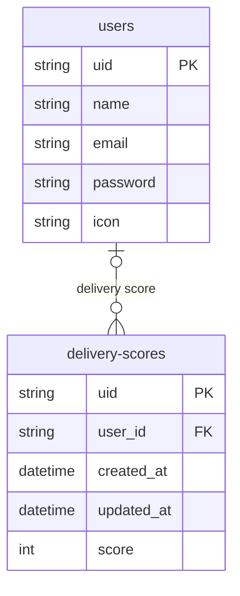

# Tables

```mermaid
erDiagram

users {
    string uid PK
    string name
    string email
    string password
    string icon
}

delivery-scores {
    string uid PK
    string user_id FK
    datetime created_at
    datetime updated_at
    int score
}

users o|--o{ delivery-scores : "delivery score"
```